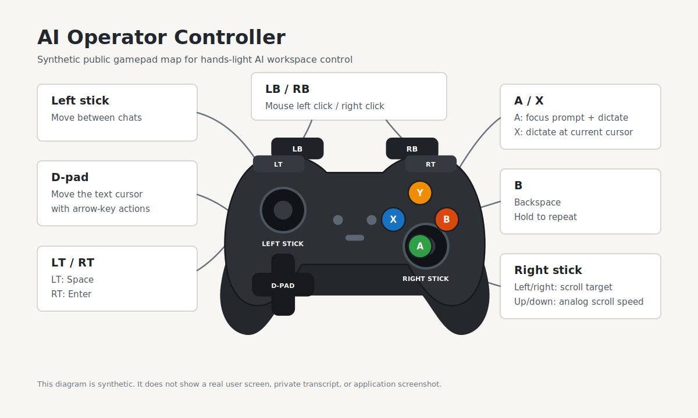
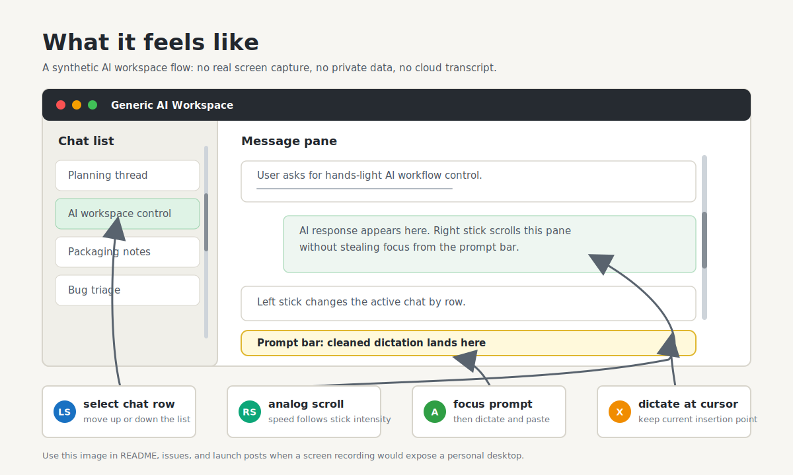

# AI Operator Controller

[](https://github.com/ryumindmitrii-cmd/ai-operator-controller/actions/workflows/ci.yml)

Local-first voice and gamepad control layer for AI workspaces.

AI Operator Controller is a Windows-first utility for controlling Codex, ChatGPT,
Cursor, browsers, editors, and other AI-heavy tools without staying glued to the
keyboard. It combines push-to-talk dictation, local speech recognition, Xbox
controller mappings, text cleanup, and application-specific command profiles.

## Status

Early public developer preview.

The working private prototype currently lives outside this repository. This repo
is the clean public home where the prototype will be migrated after privacy,
configuration, packaging, and licensing cleanup.

The current public build is useful for inspecting the project direction, running
the CLI scaffold, validating text cleanup and controller mapping logic, and
reviewing the safe Codex profile. It is not yet a one-command end-user app or a
Windows installer.

Questions, bug reports, and feature ideas should go through GitHub issues.

## Visual Overview

These public diagrams are synthetic. They do not show a real desktop, private
transcript, personal account, or application screenshot. PNG exports are stored
next to the SVG sources for launch posts and issue comments.





## Community

Use GitHub Discussions for setup questions, accessibility and alternative-input
feedback, workflow ideas, and general project discussion:
https://github.com/ryumindmitrii-cmd/ai-operator-controller/discussions

Use GitHub Issues for reproducible bugs and concrete feature requests:
https://github.com/ryumindmitrii-cmd/ai-operator-controller/issues

## What This Project Is

- A local dictation tool for power users who work inside AI chats all day.
- A controller-first command layer for AI workflows.
- A privacy-first desktop utility: speech is intended to be processed locally by
  default.
- A small, inspectable open-source project, not an enterprise agent platform.

## Target MVP

- Windows-first desktop runtime.
- Push-to-talk dictation using local `faster-whisper`.
- Speech quality default: `large-v3` for the local `faster-whisper` profile.
  Faster or smaller models should be explicit user overrides, not the default.
- Global hotkeys:
  - `F9`: dictate and paste into the active window.
  - `F8`: dictate to clipboard only.
- Xbox-compatible controller controls:
  - `A`: focus near the lower-center message input, move the caret to the end,
    dictate, and paste.
  - `X`: dictate and paste at the current text cursor without moving focus.
  - `Y`: toggle the Codex side bar with `Ctrl+Alt+B`.
  - `B`: Backspace; hold to repeat.
  - `LB`: Left mouse click.
  - `RB`: Right mouse click.
  - `LT`: Space.
  - `RT`: Enter.
  - Left stick up/down: move to previous/next chat.
  - D-pad: move the text cursor with arrow-key actions.
  - Right stick left/right: move the mouse to the chat list or message pane so
    scrolling targets the intended area without changing text-input focus.
  - Right stick up/down: scroll the selected chat area, with repeat speed scaled
    by stick intensity.
  - Menu/Start: toggle the bottom panel with `Ctrl+J`.
- Local text cleanup:
  - replacement dictionary;
  - filler phrase filter;
  - voice commands such as "new line" and "send".
- Dictation quality gate:
  - keep raw, cleaned, and final text separate inside the runtime report;
  - distinguish "user requested send" from "safe to press Enter";
  - block automatic Enter when confidence is low, text is long, or local
    polishing changed the text too much.
- Private learning candidate pipeline:
  - collect reviewed hotword, replacement, punctuation, and assistant-guard
    candidates without storing raw chats in git;
  - keep sensitive contexts separated by project profile.
- System tray status indicator.
- App profiles for Codex, ChatGPT, Cursor, browsers, and editors.

## Non-Goals

- Not a general-purpose gamepad mapper.
- Not a full voice-control replacement for Talon or Dragon.
- Not a cloud transcription product.
- Not an agent framework.
- Not tied to one private user's local paths or personal workflows.

## Repository Layout

```text
.
|-- src/ai_operator_controller/   # Python package
|-- config/examples/              # safe public example configs
|-- docs/                         # product, architecture, roadmap, release notes
|-- scripts/                      # future install/dev scripts
|-- tests/                        # test suite
|-- AGENTS.md                     # project rules for AI coding agents
|-- pyproject.toml                # Python packaging metadata
`-- README.md
```

## Development Setup

```powershell
git clone https://github.com/ryumindmitrii-cmd/ai-operator-controller.git
cd ai-operator-controller
powershell -NoProfile -ExecutionPolicy Bypass -File .\scripts\setup-dev.ps1
powershell -NoProfile -ExecutionPolicy Bypass -File .\scripts\smoke.ps1
powershell -NoProfile -ExecutionPolicy Bypass -File .\scripts\smoke.ps1 -WithMicrophone
powershell -NoProfile -ExecutionPolicy Bypass -File .\scripts\smoke.ps1 -WithSpeechModel -SpeechAudioPath <PATH_TO_WAV>
powershell -NoProfile -ExecutionPolicy Bypass -File .\scripts\smoke.ps1 -WithDictateRun
```

The first smoke command skips microphone access. The second command includes a
metadata-only microphone dry-run and still does not save audio, transcribe
speech, write clipboard content, or send keyboard input. The `doctor` check is
also read-only: it can enumerate local audio and controller devices, but it does
not record, transcribe, paste, or press keys.

Useful individual checks:

```powershell
.\.venv\Scripts\python.exe -m ai_operator_controller --help
.\.venv\Scripts\python.exe -m ai_operator_controller doctor
.\.venv\Scripts\python.exe -m ai_operator_controller doctor --profile config\examples\profile.codex.windows.json
.\.venv\Scripts\python.exe -m ai_operator_controller init-local-config
.\.venv\Scripts\python.exe -m ai_operator_controller plan-action cursor_left
.\.venv\Scripts\python.exe -m ai_operator_controller simulate-gamepad --profile config\examples\profile.codex.windows.json --axis right_stick_x 0.8
.\.venv\Scripts\python.exe -m ai_operator_controller simulate-gamepad --profile config\examples\profile.codex.windows.json --button y down
.\.venv\Scripts\python.exe -m ai_operator_controller clean-text --rules config\examples\replacements.example.json --text "uh first line new line second line send"
.\.venv\Scripts\python.exe -m ai_operator_controller record-once --seconds 2 --dry-run
.\.venv\Scripts\python.exe -m ai_operator_controller transcribe-file --speech-profile config\examples\speech.local-quality.example.json --audio-file <PATH_TO_WAV> --dry-run
.\.venv\Scripts\python.exe -m ai_operator_controller dictate-run --seconds 2 --rules config\examples\replacements.example.json --dry-run
.\.venv\Scripts\python.exe -m ai_operator_controller polish-text --text "так смотри я думаю что это можно сделать но надо проверить локально"
.\.venv\Scripts\python.exe -m ai_operator_controller dictate-once --rules config\examples\replacements.example.json --text "uh first line new line second line send"
.\.venv\Scripts\python.exe -m ai_operator_controller listen-gamepad --profile config\examples\profile.codex.windows.json --dry-run --max-events 5
```

For a more detailed Windows setup and current capability notes, see
`docs/windows-quickstart.md`.

The `doctor` command reports local runtime readiness before any desktop
automation runs. It checks the package import, Python/platform, audio input
visibility, selected microphone index, speech profile, `faster-whisper` /
CTranslate2 availability, CUDA and compute-type status, and physical gamepad
visibility. Add `--profile` to validate public app profiles, including hotkeys,
controller bindings, action names, Codex focus targets, and obvious
private/local markers.

The `init-local-config` command copies safe public examples into `config/local/`
for local editing. It creates missing files only and never overwrites existing
local config. The `config/local/` directory is ignored by git.

The `plan-action` command runs the output layer in dry-run mode. It shows which
keyboard, mouse, or scroll operation would run without sending real desktop
input.

The `simulate-gamepad` command runs the public Codex controller profile through
the same dry-run output layer. It is intended for mapping tests and does not read
from a physical controller yet.

The `clean-text` command runs dictation text through replacement, filler phrase,
and trailing send-command rules. It accepts text through `--text` or stdin. Keep
personal replacement dictionaries out of git; use the public example file as a
template for local private copies.

The `polish-text` command applies the first local-only punctuation polish layer.
It is deterministic and conservative: it adjusts spacing, sentence
capitalization, and common Russian dictation commas without sending text to an
external service or adding new content.

The `record-once --dry-run` command records a short microphone sample and prints
only safe audio metadata such as duration, frame count, RMS, and peak level. It
does not save audio, transcribe speech, write clipboard content, or send keyboard
input.

The `transcribe-file --dry-run` command runs a local `faster-whisper` speech
profile against an explicit audio file and prints the transcript plus technical
metadata. It does not save audio, write clipboard content, or send keyboard
input. Model downloads are disabled by default; pass `--allow-model-download`
only when you intentionally want `faster-whisper` to fetch a missing model.

The `dictate-run --dry-run` command records a temporary microphone sample,
transcribes it locally, applies cleanup/polish and the dictation quality gate,
prints planned output events, and deletes the temporary audio file. It does not
touch the clipboard or send keyboard input.

The same command can execute the first real Windows output path when explicitly
run with `--execute-output` instead of `--dry-run`. In paste mode it writes the
dictated text to the clipboard, sends `Ctrl+V` to the active window, and presses
`Enter` only when the dictation quality gate allows auto-send. Use it only after
focusing a safe test window. Real-output mode hides dictated text in terminal
output and prints metadata-only output events.

The `dictate-once` command runs the first public dictation pipeline in preview
mode. It accepts transcript text through `--text` or stdin, applies text cleanup,
and prints the dry-run output for `dictate_paste` or `dictate_clipboard` without
recording audio or sending real keyboard input. Its quality report separates a
recognized trailing send command from actual auto-send permission. If the text is
too long, the optional recognition confidence is low, or local polishing changes
the text too much, `Auto-send` is blocked and `press_keys: enter` is not planned.

The `listen-gamepad --dry-run` command reads a physical controller through
`pygame`, maps it through the selected profile, and prints the actions that would
run. It does not send keyboard, mouse, clipboard, or dictation output.

The private learning pipeline is specified in `docs/private-learning-pipeline.md`.
Its public example format stores reviewed candidates only. Raw chats,
transcripts, recordings, screenshots, and clipboard content must stay out of git.

## Security Checks

```powershell
powershell -NoProfile -ExecutionPolicy Bypass -File .\scripts\smoke.ps1
powershell -NoProfile -ExecutionPolicy Bypass -File .\scripts\smoke.ps1 -WithMicrophone
powershell -NoProfile -ExecutionPolicy Bypass -File .\scripts\smoke.ps1 -WithSpeechModel -SpeechAudioPath <PATH_TO_WAV>
powershell -NoProfile -ExecutionPolicy Bypass -File .\scripts\smoke.ps1 -WithDictateRun
.\.venv\Scripts\python.exe -m ruff check src tests
.\.venv\Scripts\python.exe -m bandit -r src
.\.venv\Scripts\python.exe -m pip_audit
.\.venv\Scripts\python.exe -m detect_secrets scan
```

## Public Release Rule

Before the first public GitHub push, run through:

- `docs/public-release-checklist.md`
- `docs/privacy-and-safety.md`
- `docs/migration-from-local-dictation.md`

Do not publish private replacements, local logs, transcripts, `.env` files,
recordings, personal paths, or machine-specific startup shortcuts.
